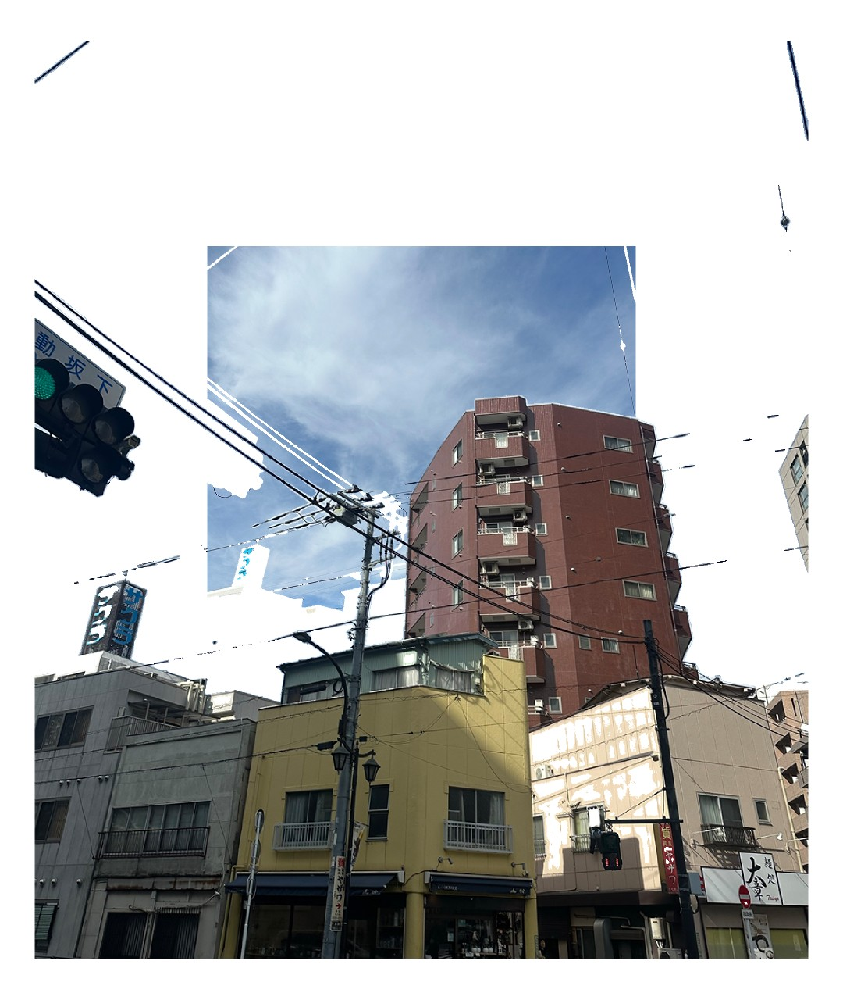

# about 
A project that samples color from an image depending on user input and pushes sections that match the colors back in 3D space. The user can select multiple colors from an input image, control the amplitude of the 3D effect, and the algorithm to calculate the color distance. either [Euclidean Color difference](https://en.wikipedia.org/wiki/Color_difference) or [lab](https://en.wikipedia.org/wiki/CIELAB_color_space). The user can eaisly add new effects that only effect regions of a picture that are within a threshold range.  The project started by me wanting to apply effects in processing only to the bakground of videos / pictures. The purpose of the project is to be used as an interesting design tool.

## Selection mode
The program starts in selection mode. This is when the user, by klicking with the mouse on the screen, selects the colors that are later to be effected by the 3D transforamtion. Multiple colors can be selected. 

Press 's' to exit selection mode and to start applying the 3D transforamtion. 

## Adjustable parameters. 
MouseX & MouseY.  <br>
MouseX changes the possible range from the sampled color that should be effected by the 3D transforamtion <br>
MouseY changes the amplitude of the 3D transformation. 

```processing
key()
's' = switch from selection mode to drawMode
'e' = switch color diiferance algoritm.
'p' = save the current frame.
```
for custom image input please change: 
```processing
String imgString = "test2.png";
```
below is an example where many different colors from the houses were selected to create an effect where only the background is pushed "back" in relation to the viewer.  


 
